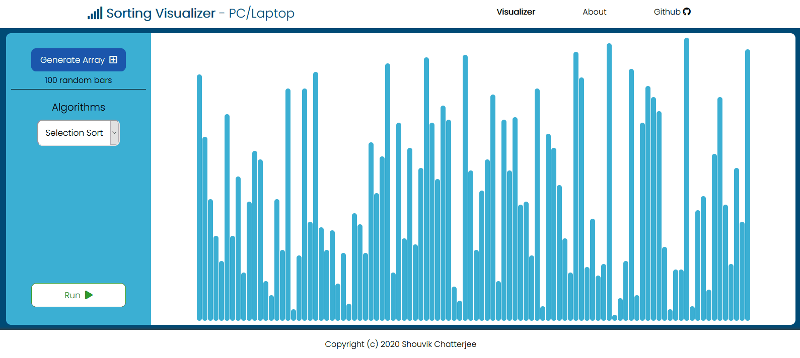

# Sorting-Visualizer
An Educational Web App That Shows Several Sorting Algorithms in action.

## Preview

- Use the [Online Demo](https://techieshouvik.github.io/Sorting-Visualizer/)

## Built With
- HTML
- CSS
- Vanilla JS

## Prerequisites
* Basic HTML, CSS & Js knowledge
* Important Js Concepts to explore
[setTimeOut()](https://www.w3schools.com/jsref/met_win_settimeout.asp)
[setInterval()](https://www.w3schools.com/jsref/met_win_setinterval.asp)
[querySelector](https://www.w3schools.com/jsref/met_document_queryselector.asp)

## Contributing
When contributing to this repository, please first discuss the change you wish to make via issue, email, or any other method with the owners of this repository before making a change.

👌 Ways to improve the project:
- Implement new Sorting Algorithms
- Dark Theme
- Report bugs

## License ⚖
This project is licensed under the MIT License - see the [LICENSE](LICENSE) file for details